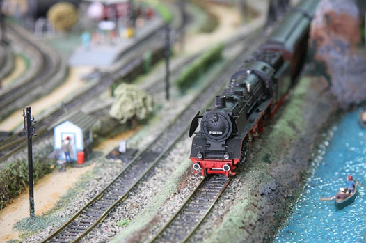

# Toys and Models / SQL - Powerbi
#### by Halil Ibrahim Celikel & Mai Tran & Nicolas Ortuno

## Summary of the Project

In this project, we were commissioned by a company selling models and scale models. The company already had a database that lists employees, products, orders, and much more. We were invited to browse and discover this database to create a dashboard which the director could refresh each morning to have the latest information in order to manage the company.

According to the directives, our dashboard should revolve around these 4 main topics: sales, finance, logistics, and human resources. Here are the indicators that should be present in our dashboard: 

~~~~~
- Sales: The number of products sold by category and by month, with comparison and rate of change compared to the same month of the previous year.
- Finances: 
  -	The turnover of the orders of the last two months by country. 
  -	Orders that have not yet been paid
- Logistics: The stock of the 5 most ordered products.
- Human Resources: Each month, the 2 sellers with the highest turnover.
~~~~~

## The diagram of the database
Here is the diagram of the database:

## SQL queries

***1. Sales***

***2. Finances***

***3. Logistics***

***4. Human Resources***

